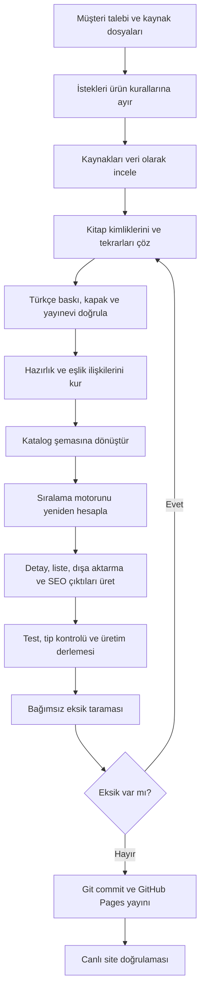
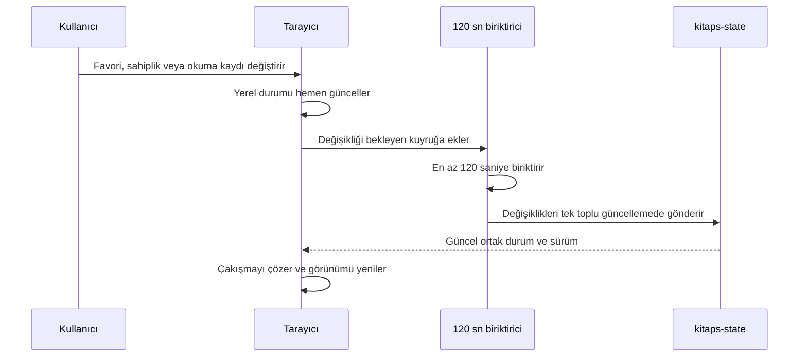

# Kitaplık: müşteri ihtiyaçları ve süreç raporu

**Rapor tarihi:** 28 Eylül 2026
**Müşteri:** İsmail Karaça
**Ürün:** Kitaplık
**Canlı ürün:** https://karacaismail.github.io/kitaps/
**Uygulama deposu:** https://github.com/karacaismail/kitaps
**Paylaşılan durum deposu:** https://github.com/karacaismail/kitaps-state

## 1. Yönetici özeti

Müşterinin istediği ürün basit bir kitap listesi değildir. Ürün; kitap kimliklerinin doğru tutulduğu, Türkçe baskıların ayırt edildiği, kitaplar arasındaki hazırlık ve eşlik ilişkilerinin görülebildiği, neden önce okunması gerektiğini açıklayan ve kişisel kullanım verilerini cihazlar arasında taşıyan bir okuma karar sistemi olmalıdır.

Bu çalışma sonunda katalog 794 benzersiz kitaba ulaştı. 26 koleksiyon, 120 grup ve 21 kategori tek bir şemada birleşti. Son iki kaynak kümeden 60 öneri işlendi; iki tekrar nedeniyle kataloğa 58 benzersiz eser eklendi. Sıralama motoru ayrı TypeScript dosyalarına taşındı. Kaynaklardaki hazır puanlar kullanılmadı; kitapların özellikleri ve katalog ilişkileri üzerinden yedi açıklanabilir ölçüt hesaplandı.

En kritik ürün kuralı kesinleştirildi: bir kitabın okunmuş olması, okunuyor olması, yarım bırakılması veya kişisel sıraya eklenmesi kitabın puanını, olgunluk düzeyini ya da diğer kitaplara göre sırasını değiştirmez. Kişisel eylemler yalnızca kişisel kayıt olarak saklanır. Sahiplik bilgisi ise erişim hazır oluşu ve koleksiyon kapsamı ölçütlerinde kullanılabilir.

## 2. Müşteri gerçekte ne yapmak istiyor?

Müşteri üç temel soruya güvenilir cevap veren bir sistem istiyor:

1. **Bu kitap tam olarak hangi eser?** Orijinal ad, varsa Türkçe ad, yazarlar, orijinal yayınevi, Türkçe yayınevi, ideal çevirmen ve doğru kapak birlikte tutulmalı.
2. **Bu kitabı neden ve ne zaman okumalıyım?** Sistem; hazırlık kitaplarını, birlikte okunabilecek eserleri, zorluk ve kalıcılık gibi etkenleri açıklamalı ve okuma önceliğini kendisi hesaplamalı.
3. **Kişisel kitaplığım her yerde aynı mı?** Favoriler, sahiplik ve okuma kayıtları bilgisayar, telefon ve başka kullanıcılar arasında GitHub tabanlı paylaşılan durum üzerinden görülebilmeli.

Bu nedenle ürünün özü katalog, karar motoru ve cihazlar arası durum eşitlemesinin birlikte çalışmasıdır.

## 3. Müşteri ihtiyaçları

| İhtiyaç | Beklenen davranış | Başarı ölçütü |
|---|---|---|
| Veri doğruluğu | Türkçe ve orijinal eser kimlikleri birbirine karışmamalı | Çevirisi olmayan kitap özgün adıyla görünür |
| Baskı doğruluğu | Türkçe kayıt Türkçe kapak ve Türkiye yayıneviyle eşleşmeli | Kapak, başlık ve yayınevi aynı baskıyı anlatır |
| Açıklanabilir sıralama | Kullanıcı toplam puanın hangi ölçütlerden oluştuğunu görür | Detay sayfasında faktörler ve gerekçeler bulunur |
| Eylem bağımsızlığı | Okuma durumu ve kişisel sıra puanı değiştirmez | Aynı katalog tüm cihazlarda aynı puanı üretir |
| Dinamik katalog | Kitap eklenince veya çıkarılınca ilişkiler yeniden değerlendirilir | Sıralama sabit elle yazılmış bir liste değildir |
| Cihazlar arası devamlılık | Kişisel durum başka cihazlarda görünür | İkinci GitHub deposu üzerinden eşitleme yapılır |
| Düşük GitHub trafiği | Her tıklama ayrı commit oluşturmaz | Değişiklikler en az 120 saniye biriktirilir |
| Mobil ve masaüstü tutarlılığı | Aynı veri ve motor aynı sonucu verir | Ekran genişliği puanı değiştirmez |
| İnsan odaklı SEO | Filtre, sayfa ve kitap durumu bağlantıyla paylaşılabilir | URL, başlık, canonical ve sitemap tutarlıdır |
| Hızlı tarama | Kartlar gereksiz metin ve etiketlerle dolmaz | Etiket ayrıntıları kitap detayında görünür |
| Taşınabilir veri | Katalog kullanıcı tarafından indirilebilir | Footer JSON dışa aktarma sunar |
| Bakım kolaylığı | Veri, sıralama, görünüm ve durum kodları ayrıdır | OOP, MVVM ve katmanlı sorumluluklar korunur |

## 4. Son iki gündeki isteklerin dökümü

### Katalog ve veri

- Yanlış kitaba ait görünen kapakların düzeltilmesi ve katalog genelinde kapak kimliği denetimi.
- Girişimcilik, temel okuma ve ön hazırlık önerilerindeki yeni kitapların eklenmesi.
- Öneri metinlerinin hazır puanlarının kopyalanmaması; yalnızca faktör, ilişki ve gerekçelerinden yararlanılması.
- Çevirisi bulunmayan kitapların Türkçeleştirilmiş başlıkla gösterilmemesi.
- Türkçe anlamın açıklama alanında ayrıca verilebilmesi.
- Orijinal ad, Türkçe ad, yazarlar, orijinal yayınevi, ideal çevirmen ve Türkiye yayınevi alanlarını içeren JSON dışa aktarma.
- Etiketlerin liste kartlarından kaldırılıp yalnızca kitap detayında gösterilmesi.

### Sıralama ve karar desteği

- Varsayılan sıralamanın satın alma önceliği yerine okuma önceliği olması.
- Her kitabın birden fazla koşula dayalı puanlara sahip olması.
- Puanların kitap detayının sonunda açıkça gösterilmesi.
- Kitap ekleme veya çıkarma işleminin bütün katalog sırasını yeniden hesaplatması.
- Olgunluk düzeyinin sıralama deneyimine katılması.
- Okunmuş, okunuyor, duraklatılmış veya sıraya eklenmiş kitapların puanı ve sıralamayı etkilememesi.
- Algoritmanın ayrı dosyada, TypeScript ve nesne yönelimli bir yapıda tutulması.

### Durum eşitleme

- İkinci bir GitHub deposunun zorunlu olması.
- Bilgisayarda yapılan değişikliğin telefonda ve başka bir kullanıcıda görülebilmesi.
- GitHub commit ve istek sayısını azaltmak için değişikliklerin istemci tarafında biriktirilmesi.
- İlk değişiklikten sonra en az 120 saniye beklenerek toplu gönderim yapılması.
- Projenin ve durum verisinin açık olabileceğinin açıkça kabul edilmesi.

### Arayüz ve deneyim

- Üstteki kategori şeridinin tamamen kaldırılması.
- Kızım İçin seçeneğinin üst eylem grubuna taşınması ve kız çocuğu simgesi kullanması.
- Favoriler, Kitaplığım ve Kızım İçin eylemlerinin masaüstü dahil yalnızca simgeyle gösterilmesi.
- Favori yıldızı yerine kalp, kitaplık için belirgin bir kitaplık simgesi kullanılması.
- Logo kapsayıcısının simge ile Kitaplık yazısını tek yüzeyde birleştirmesi.
- Kapak alanının 9:16 yerine 3:4 oranında olması.
- Çeviri var ve yok durumlarının kısa araç ipuçlarıyla açıklanması.
- Çeviri yok durumunda eksi yerine çarpı simgesi kullanılması.
- Üst eylemlerin tek satıra sığması ve simgelerin büyütülmesi.
- Alt sayfa çekme tutamacının yatay olarak ortalanması.
- Sayfalamanın veri yoğunluğuna uyumlu ve olgun bir bileşen olması.
- Yerel seçim kutusu yerine bütün platformlarda tutarlı özel açılır menü kullanılması.
- Notlar bağlantısının footer alanına taşınması.
- Kitaplığım, sıra, kümeler ve notlar sayfalarındaki açıklama paragraflarının kaldırılması.
- Footer içinde yaratılış ve güncelleme tarihlerinin ayrı gösterilmesi.
- Genel UX estetiğinin, bileşen çeşitliliğinin ve mobil kullanımın geliştirilmesi.

### URL ve SEO

- Beşinci sayfa gibi arayüz durumlarının URL üzerinde görünmesi.
- Sayfa, kategori, görünüm ve kitap ayrıntılarının geri tuşu, yenileme ve paylaşılabilir bağlantılarla korunması.
- İnsan odaklı URL politikası, okunabilir kitap yolları, canonical kayıtları ve sitemap üretimi.

### Kalite ve inceleme

- Paralel çoklu ajanlarla geliştirme.
- Yapılanların bağımsız bir ikinci gözle denetlenmesi ve eksiklerin giderilmesi.
- Sonuçta müşteri ihtiyaçları, eksikler ve süreç haritasını içeren ayrıntılı rapor hazırlanması.

## 5. Uygulanan çözüm

### 5.1 Veri katmanı

- Katalog 794 benzersiz eserde birleştirildi.
- 50 kitaplık temel okuma kümesi ayrı kaynak dosyasında tutuldu.
- Kullanıcının 10 kitaplık ön hazırlık JSON kaynağı değişmeden arşivlendi ve katalog şemasına dönüştürüldü.
- Ön hazırlık listesindeki iki tekrar tek eser kimliğinde birleştirildi; sekiz yeni benzersiz eser eklendi.
- Temel okuma kümesindeki 50 eserin tamamına yerel kapak dosyası bağlandı. Güvenilir Türkçe baskısı doğrulanabilen 48 eser Türkçe kapakla eşleştirildi.
- Ön hazırlık kümesindeki 10 eserin tümü doğrulanmış Türkçe baskı ve yerel kapakla eşleştirildi.
- Kitap ilişkileri hazırlık ve eşlik olarak ayrıldı. Hazırlık ilişkisi önce/sonra yönü taşır; eşlik ilişkisi iki eseri karşılaştırmalı okumaya bağlar.

### 5.2 Sıralama motoru

Sıralama mantığı uygulama görünümünden ayrılarak ReadingPriorityEngine, policy ve types dosyalarına taşındı. Politika sürümü reading-priority-v1.2.0 olarak kaydedildi.

Yedi ölçüt kullanılıyor:

| Ölçüt | Ağırlık | Anlamı |
|---|---:|---|
| Editoryal uzlaşma | %13 | Eserin kaynaklardaki ortak önem düzeyi |
| Öğrenme kaldıracı | %22 | Sonraki okumaları açma ve ilişkisel katkı |
| Hazırlık uyumu | %15 | Önkoşul ve okuma rotasıyla uyum |
| Erişim hazır oluşu | %14 | Eserin elde bulunması ve erişilebilirliği |
| Koleksiyon kapsamı | %10 | Katalogdaki önemli boşlukları kapatma değeri |
| Zorluk uyumu | %12 | Eserin bilişsel yükünün rotaya uygunluğu |
| Kalıcılık | %14 | Bilginin zaman içindeki dayanıklılığı |

Kaynak dosyalar doğrudan puan taşımaz. Motor, katalog özelliklerinden ve ilişkilerden puan üretir. Eşlik ilişkileri öğrenme kaldıracına katkı sağlar fakat hazırlık yükü oluşturmaz.

Okuma durumu ve kişisel sıra motor girdisinden çıkarıldı. Eşitlik çözümü puan, güven düzeyi ve sabit kitap kimliğiyle yapılır. Böylece aynı katalog farklı cihazlarda aynı sonucu verir.

### 5.3 Mimari

- **Model:** katalog verisi, kaynak kayıtları, ilişkiler ve GitHub durum şeması.
- **ViewModel:** sıralama görünüm modeli ve kitap keşif durumu.
- **View:** React bileşenleri, kartlar, kitap ayrıntısı, filtreler ve footer.
- **Servis/Repository:** GitHubStateRepository ve GitHubStateBatcher.
- **Politika:** ağırlıklar ve olgunluk eşikleri ayrı dosyada.

Bu ayrım veri güncellemelerinin görünüm koduna, kişisel durumun da akademik sıralama mantığına sızmasını sınırlar.

### 5.4 GitHub tabanlı durum

İkinci açık depo kitaps-state olarak oluşturuldu. İstemci değişiklikleri yerelde bekletir ve en az 120 saniyelik pencere sonunda toplu gönderir. Bekleyen işlemler, çakışma çözümü ve yeniden deneme davranışları test kapsamındadır. Arayüz, açık depoda hangi verilerin görülebileceğini kullanıcıya bildirir.

### 5.5 UX ve SEO

- Mobil ve masaüstü puan farkına yol açan kişisel durum bağı kaldırıldı.
- Kartlardaki konu etiketleri kaldırıldı; ayrıntı sayfasındaki bağlam korundu.
- Kitap ayrıntısında hazırlık kitapları ve birlikte okunabilecek eserler ayrı gösteriliyor.
- Okunabilir kitap yolları, statik kitap sayfaları, canonical kayıtları ve sitemap yenilendi.
- 794 kitap için statik SEO sayfası ve toplam 1.069 herkese açık URL üretildi.
- Footer JSON dışa aktarma, yaratılış tarihi ve güncelleme tarihi akışları korunuyor.

## 6. Sayısal sonuç

| Gösterge | Sonuç |
|---|---:|
| Benzersiz kitap | 794 |
| Koleksiyon | 26 |
| Grup | 120 |
| Kategori | 21 |
| Son kaynaklardaki öneri | 60 |
| Benzersiz yeni eser | 58 |
| Temel okuma kitabı | 50 |
| Türkçe kapaklı temel eser | 48 |
| Ön hazırlık kitabı | 10 |
| Türkçe kapaklı ön hazırlık eseri | 10 |
| Seçilmiş kapak kaydı bulunan kitap | 765 |
| Önce ilişkisi | 183 |
| Sonra ilişkisi | 193 |
| Eşlik ilişkisi | 16 |
| Otomatik test | 98 |

## 7. Süreç haritası

### Kişisel durum eşitleme akışı

## 8. Eksik yapılanlar, hatalar ve düzeltmeler

| Sorun | Neden eksikti | Alınan önlem |
|---|---|---|
| İlk sıralama sürümü okuma durumu ve sıradan etkileniyordu | Kişisel eylem ile kitabın yapısal değeri aynı bağlamda değerlendirilmişti | Bu girdiler motor sözleşmesinden çıkarıldı; gerçek katalog üzerinde değişmezlik testleri eklendi |
| Eşlik kitapları önkoşul gibi davranıyordu | Bütün ilişkiler tek önce/sonra modeliyle ele alınmıştı | companions ilişkisi ayrıldı; hazırlık yüküne etkisi kapatıldı |
| İlk kapak turu tamamlanmamıştı | Sadece açıkça eksik kayıtlar taranmıştı | 50 temel kitabın tamamı yeniden denetlendi; 48 Türkçe kapak doğrulandı |
| Bazı uluslararası kapak başlıkları özgün adı gölgeliyordu | Görünen başlık ile eser kimliği aynı alanı kullanıyordu | originalTitle alanı eklendi ve dışa aktarma kuralı düzeltildi |
| Doküman ve katalog sayıları geride kalmıştı | Veri üretimi sonrasında belgeler otomatik güncellenmiyordu | ADR ve doğrulama belgesi son üretim sayılarıyla güncellendi |
| Latin dışı başlıklarda yol çakışması riski vardı | Basit karakter temizleme bazı başlıkları boş bırakıyordu | Okunabilir yedek başlık ve benzersiz kimlik davranışı eklendi |

## 9. Yapılamayan veya halen sınırlı kalan işler

1. **Fiziksel cihaz testi:** Üretim derlemesi ve yapısal mobil testler geçti; gerçek iPhone, Android cihaz ve ekran okuyucuyla uçtan uca elle test yapılmadı.
2. **Kalan kapaklar:** Katalogdaki 29 kitap için seçilmiş kapak kaydı yok. Bunların 11'inde eser kimliği veya baskı bilgisi otomatik eşleştirme için yeterince açık değil.
3. **İdeal çevirmen doğruluğu:** JSON dışa aktarma alanı var; ancak 794 kitabın tamamı için bağımsız edebî çeviri değerlendirmesi yapılmadı. Alan doğrulanmış veya eldeki en iyi katalog kaydını verir.
4. **Türkçe baskısı doğrulanamayan iki eser:** Artificial Intelligence: A Guide for Thinking Humans ve The Four Steps to the Epiphany için güvenilir Türkçe basım bulunamadığı için uluslararası kapak korundu.
5. **Son turda bağımsız Claude çalıştırması:** Önceki ürün inceleme belgelerinde beş Claude Code araştırma turu kayıtlıdır. Bu son 60 kitaplık ekleme turunda çağrılabilir bağımsız Claude modeli kullanılmadı; denetimler paralel ajanlarla yapıldı. Bu nedenle son turun Claude tarafından ayrıca onaylandığı iddia edilemez.
6. **Ağırlık kalibrasyonu:** Yedi ölçütün ağırlıkları tutarlı ve test edilebilir bir politika oluşturuyor; gerçek kullanıcı davranışından türetilmiş uzun dönemli kalibrasyon verisi henüz yok.

## 10. Riskler ve önlemler

| Risk | Etki | Önlem |
|---|---|---|
| Açık durum deposunda kişisel notların görünmesi | Gizlilik beklentisiyle çatışabilir | Arayüzde açıklık bildirimi; sır içeren veri saklamama kuralı |
| GitHub API sınırı veya geçici ağ hatası | Cihazlar arası güncelleme gecikir | 120 saniyelik toplama, yerel bekleyen kuyruk ve yeniden deneme |
| Kaynak sitelerde kapak URL'lerinin değişmesi | Görseller bozulur | Doğrulanmış kapakları yerel statik dosya olarak saklama |
| Yanlış kitap eşleştirmesi | Başlık, yazar ve kapak birbirinden kopar | Kimlik, ISBN, yayınevi ve başlık birlikte kontrol edilir |
| Katalog büyüdükçe sıralamanın kayması | Öncelikler beklenmedik biçimde değişebilir | Sürüm kontrollü politika, deterministik eşitlik çözümü ve regresyon testleri |
| Kişisel eylemin yeniden puana sızması | Cihazlar farklı sonuç üretir | Motor sınırında nötrleştirme ve derin eşitlik testleri |

## 11. Önerilen sonraki adımlar

1. 29 eksik kapak kaydını elle kimlik doğrulamasıyla tamamlamak.
2. Gerçek iPhone ve Android cihazlarda görünüm, dokunma hedefi, alt sayfa ve açılır menü testi yapmak.
3. VoiceOver ve TalkBack ile simge etiketleri, odak sırası ve araç ipuçlarını doğrulamak.
4. Sıralama sonuçları için aylık kullanıcı değerlendirmesi toplamak; ağırlık değişikliklerini politika sürümüyle yayımlamak.
5. İdeal çevirmen alanı için yayınevi kataloğu veya kütüphane kaynağına dayalı ayrı bir doğrulama turu yapmak.
6. Son 60 kitaplık veri ve ilişki değişikliğini bağımsız bir Claude incelemesine ayrıca göndermek.

## 12. Kabul ölçütleri

- Aynı katalog sürümü telefonda ve masaüstünde aynı puan ve sırayı üretir.
- Okuma durumu veya kişisel sıra değiştiğinde puan, olgunluk ve katalog sırası aynı kalır.
- Sahiplik değişimi yalnızca erişim ve kapsam ölçütlerinin izin verilen kısmını etkiler.
- Yeni kitap eklendiğinde ilişkiler ve puanlar yeniden hesaplanır; kaynak puanı doğrudan kopyalanmaz.
- Çevirisi olmayan eser özgün adıyla görünür.
- Kartta konu etiketi görünmez; detay sayfasında bağlam korunur.
- Her kitap için paylaşılabilir ve yenilenebilir bir URL bulunur.
- JSON dışa aktarma tanımlanan bibliyografik alanları içerir.
- Kişisel değişiklikler GitHub'a tek tek değil, en az 120 saniyelik toplu pencereyle gönderilir.
- Test, tip kontrolü ve üretim derlemesi yayın öncesinde geçer.

## Sonuç

Ürünün hedefi katalog büyüklüğü değildir; güvenilir kitap kimliği, açıklanabilir okuma sırası ve cihazlar arasında devam eden kişisel kullanımın birlikte çalışmasıdır. Mevcut sürüm bu yapının teknik temelini kuruyor. Kalan işler veri doğrulamasını, gerçek cihaz erişilebilirliğini ve sıralama ağırlıklarının kullanım verisiyle kalibrasyonunu tamamlamaya yöneliktir.
